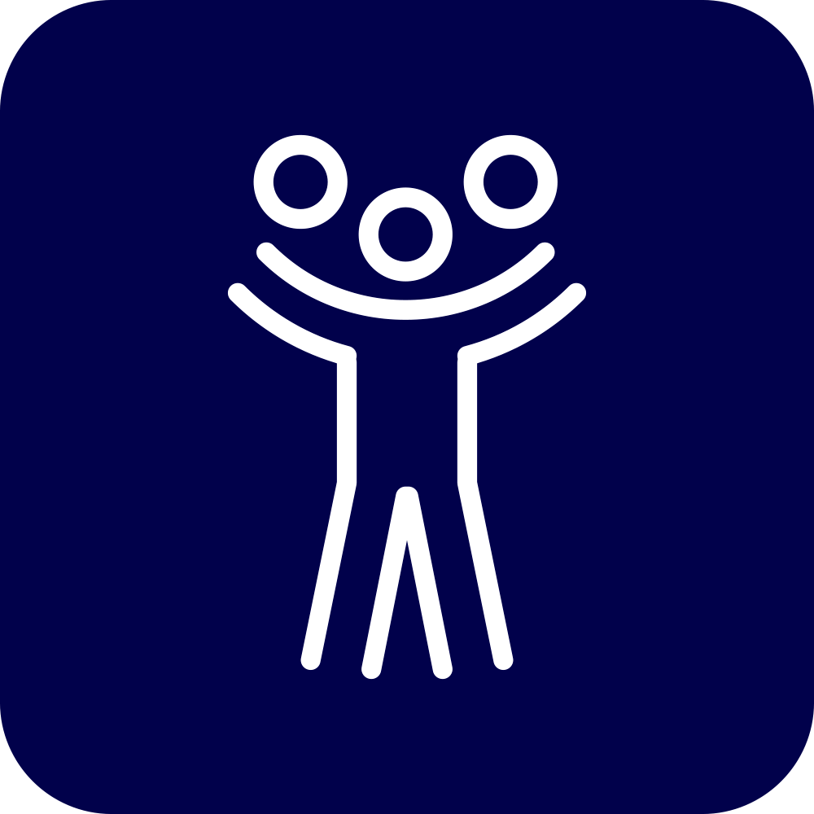

</img>

# [Antipersona](http://antipersona.co)

Antipersona simulates the experience of using Twitter as if you're signed in from any user account of your choice, providing a window into someone else's social media point-of-view. When you "become" an account on Antipersona, you can see the same timeline they see and receive the same notifications (for follows, mentions, and retweets) they receive, for 24 hours.

The advent of social media has turned our personal identities into discrete entities that we can mold to our wishes. At the same time, it has made us feel closer to other people's identities, enabling us to live a low-resolution version of their lives alongside them day by day.

Perhaps being confined to a single identity is not how we want to exist in the world anymore.  If that's the case, we need to come up with novel social and technological arrangements for sharing identities, turning them into a new kind of commons.

See
[`ARCHITECTURE.md`](https://github.com/agermanidis/Antipersona/blob/master/ARCHITECTURE.md)
for more details on the way the app uses the Twitter API endpoints.

### License

MIT
